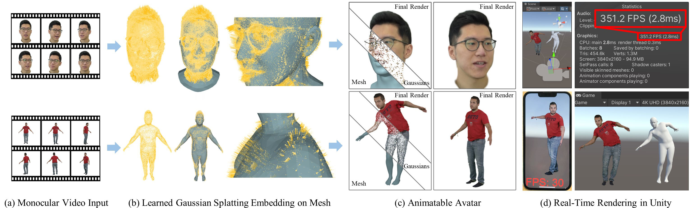
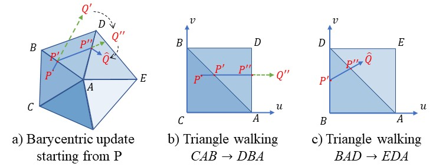

# [CVPR2024] SplattingAvatar: Realistic Real-Time Human Avatars with Mesh-Embedded Gaussian Splatting
## [Paper](https://arxiv.org/abs/2403.05087) | [Video Youtube](https://youtu.be/IzC-fLvdntA) | [Project Page](https://initialneil.github.io/SplattingAvatar)

Official Repository for CVPR 2024 paper [*SplattingAvatar: Realistic Real-Time Human Avatars with Mesh-Embedded Gaussian Splatting*](https://cvpr.thecvf.com/Conferences/2024/AcceptedPapers). 

 


<!-- - Overview -->
 
<!-- - Framework -->
 

### Lifted optimization
The embedding points of 3DGS on the triangle mesh are updated by the *walking on triangle* scheme.
See the `phongsurface` module implemented in c++ and pybind11.
 

## Getting Started
- Create conda env with pytorch.
```
conda create -n splatting python=3.9
conda activate splatting

# pytorch 1.13.1+cu117 is tested
pip install torch==1.13.1 torchvision torchaudio functorch --extra-index-url https://download.pytorch.org/whl/cu117

# pytorch3d
git clone https://github.com/facebookresearch/pytorch3d.git
cd pytorch3d
pip install -e .

# install other dependencies
pip install tqdm omegaconf opencv-python libigl
pip install trimesh plyfile imageio chumpy lpips
pip install packaging pybind11
pip install numpy==1.23.1
```

- Clone this repo *recursively*. Install Gaussian Splatting's submodules.
```
git clone --recursive https://github.com/initialneil/SplattingAvatar.git
cd SplattingAvatar

cd submodules/diff-gaussian-rasterization
pip install .

cd ../submodules/simple-knn
pip install .

cd ..
```

- Install `simple_phongsurf` for *walking on triangles*.
```
cd model/simple_phongsurf
pip install -e .
```

- Download [FLAME model](https://flame.is.tue.mpg.de/download.php), choose **FLAME 2020** and unzip it, copy 'generic_model.pkl' into `./model/imavatar/FLAME2020`,

- Download [SMPL model](https://smpl.is.tue.mpg.de/), and put `SMPL_FEMALE.pkl`, `SMPL_MALE.pkl`, `SMPL_NEUTRAL.pkl` into `./model/smplx_utils/smplx_models/smpl`.

## Preparing dataset
We provide the preprocessed data of the 10 subjects used in the paper.
- Our preprocessing followed [IMavatar](https://github.com/zhengyuf/IMavatar/tree/main/preprocess#preprocess) and replaced the *Segmentation* with [RobustVideoMatting](https://github.com/PeterL1n/RobustVideoMatting).
- Pre-trained checkpoints are provided together with the data.
- [Google Drive](https://drive.google.com/drive/folders/1YPEG1IYgkZWTlibRZfMjhXFMw58JJVeq?usp=sharing) or [Baidu Disk](https://pan.baidu.com/s/12ycpotyE4KUZ-HvhpCcVxw?pwd=bkfh)

 


## Training
```
python train_splatting_avatar.py --config configs/splatting_avatar.yaml --dat_dir <path/to/subject>
# for example:
python train_splatting_avatar.py --config configs/splatting_avatar.yaml --dat_dir C:/SplattingAvatar/bala

# use SIBR_remoteGaussian_app.exe from 3DGS to watch the training
SIBR_remoteGaussian_app.exe --path <path/to/model_path>
# for example:
SIBR_remoteGaussian_app.exe --path C:\SplattingAvatar\bala\output-splatting\last_checkpoint

# it is recommended to change "FPS" to "Trackball" in the viewer
# you don't need to chagne the "path" everytime
```
## Evaluation
```
python eval_splatting_avatar.py --config configs/splatting_avatar.yaml --dat_dir <path/to/model_path>
# for example:
python train_splatting_avatar.py --config configs/splatting_avatar.yaml --dat_dir C:/SplattingAvatar/bala/output-splatting/last_checkpoint
```

## Full-body Avatar
We conducted experiments on PeopleSnapshot.
- Please download the parameter files (the same with InstantAvatar) from: [Baidu Dick](https://pan.baidu.com/s/166jItS7ZrA3vQ8fRJM63yg?pwd=0imt) or [Google Drive](https://drive.google.com/drive/folders/1r-fHq5Q_szFYD_Wz394Dnc5G79nG2WHw?usp=sharing).
- Download PeopleSnapshot and unzip `images` and `masks` to corresponding folders from above.
- Training:
```
# override with instant_avatar.yaml for PeopleSnapshot in InstantAvatar's format
python train_splatting_avatar.py --config "configs/splatting_avatar.yaml;configs/instant_avatar.yaml" --dat_dir <path/to/subject>
# for example:
python train_splatting_avatar.py --config "configs/splatting_avatar.yaml;configs/instant_avatar.yaml" --dat_dir C:/SplattingAvatar/female-3-casual
```

## GPU requirement
We conducted our experiments on a single NVIDIA RTX 3090 with 24GB.
Training with less GPU memory can be achieved by setting a maximum number of Gaussians.
```
# in configs/splatting_avatar.yaml
model:
  max_n_gauss: 300000 # or less as needed
```
or set by command line
```
python train_splatting_avatar.py --config configs/splatting_avatar.yaml --dat_dir <path/to/subject> model.max_n_gauss=300000
```

## Citation
If you find our code or paper useful, please cite as:
```
@inproceedings{SplattingAvatar:CVPR2024,
  title = {{SplattingAvatar: Realistic Real-Time Human Avatars with Mesh-Embedded Gaussian Splatting}},
  author = {Shao, Zhijing and Wang, Zhaolong and Li, Zhuang and Wang, Duotun and Lin, Xiangru and Zhang, Yu and Fan, Mingming and Wang, Zeyu},
  booktitle = {Computer Vision and Pattern Recognition (CVPR)},
  year = {2024}
}
```

## Acknowledgement
We thank the following authors for their excellent works!
- [instant-nsr-pl](https://github.com/bennyguo/instant-nsr-pl)
- [Gaussian Splatting](https://github.com/graphdeco-inria/gaussian-splatting)
- [IMavatar](https://github.com/zhengyuf/IMavatar)
- [INSTA](https://github.com/Zielon/INSTA)

## License
SplattingAvatar
<br>
The code is released under the [Creative Commons Attribution-NonCommercial-ShareAlike 4.0 International Public License](https://creativecommons.org/licenses/by-nc-sa/4.0/legalcode) for Noncommercial use only. Any commercial use should get formal permission first.

[Gaussian Splatting](https://github.com/graphdeco-inria/gaussian-splatting/blob/main/LICENSE.md)
<br>
**Inria** and **the Max Planck Institut for Informatik (MPII)** hold all the ownership rights on the *Software* named **gaussian-splatting**. The *Software* is in the process of being registered with the Agence pour la Protection des Programmes (APP).  
